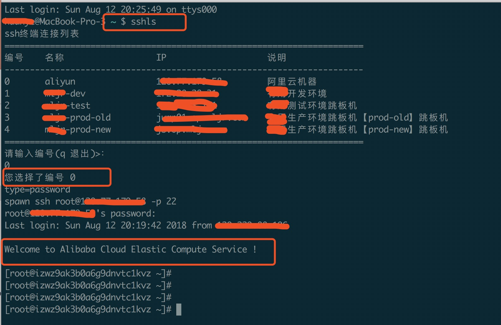

## terminal tool

Linux / MacOS 系统用来连接ssh的命令行工具

### 环境配置 
这个shell脚本需要安装 [shell jq](https://www.ibm.com/developerworks/cn/linux/1612_chengg_jq/index.html?ca=drs-&utm_source=tuicool&utm_medium=referral)

在mac下安装jq，使用brew install jq就可以了，前提是安装了homebrew，如果在linux ubuntu下，应该可以使用sudo apt-get install jq安装。

### 使用说明

1. 确保自己安装了jq

2. clone本项目到本地某个目录 例如 `/Users/funye/terminal-tool`

3. 修改config.json的配置为自己的服务器配置
   ```json
   {
        "name": "server-test", // 服务器名称，自定义
        "type": "sshkey", // ssh的方式，password或者sshkey,分别代表使用【密码连接】和使用【sshkey】连接
        "keyFile": "group_dev.pem", // sshkey 秘钥文件本地地址。 或者直接把秘钥拷贝到和start.sh同文件夹，此处就可直接填文件名
        "host": "192.168.0.200", // 服务主机的IP 或者域名
        "port": "22", // ssh端口
        "user": "group_dev", // ssh登录用户名
        "password": "0Ox5DQhYz5Ej8gSf", // ssh密码或者 sshkey的加密密码
        "remark": "测试环境跳板机"// 服务器具体描述 
    }
    以上参数，没有的时候填 "" 即可， 如果使用的是sshkey的方式登录
    ```
**sshkey 秘钥文件本地地址。 或者直接把秘钥拷贝到和start.sh同文件夹，此处就可直接填文件名**

4. 执行进入start.sh所在目录，执行 start.sh 打开列表，选中服务器编号即可， 如果是使用秘钥文件登录，可能会报错 `permissions xxx for 'xxxxxx' are too open` 这个时候，修改下秘钥文件权限  chmod 400 xxx  (xxx为秘钥文件名称)

5. 如果想要更加快速，可以在 ~/.basg_profile 中添加别名。例如： `alias sshls='cd /Users/funye/terminal-tool && ./start.sh'` 这样在命令行直接键入 sshls 回车就可开始ssh连接。其中`/Users/funye/terminal-tool`为项目下载下来的目录

### 实现原理

**spawn** 命令实现模拟的人机交互

**shell jq** 解析服务器的配置(config.json) 

### 运行效果



